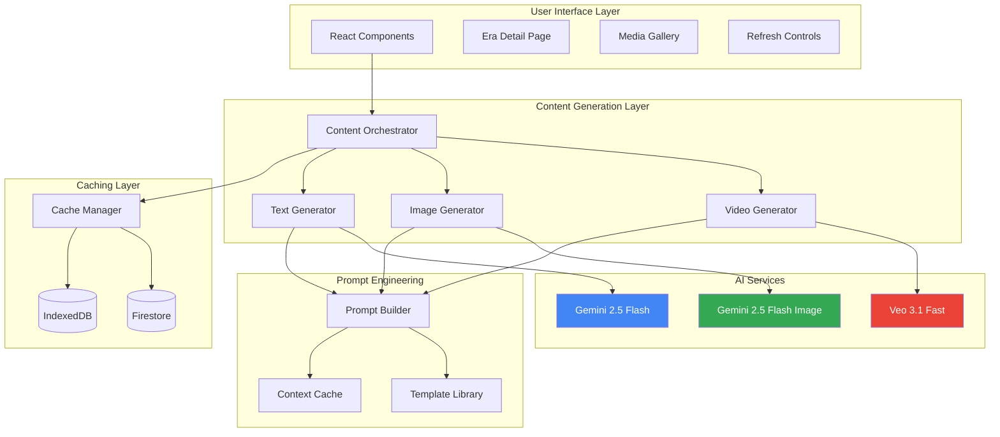
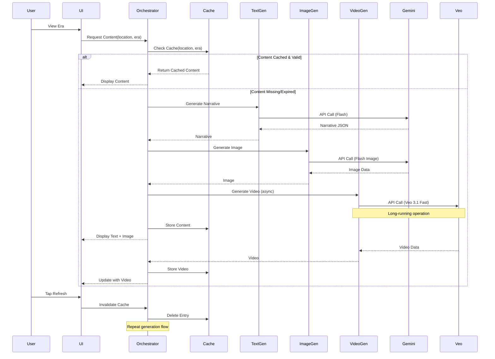
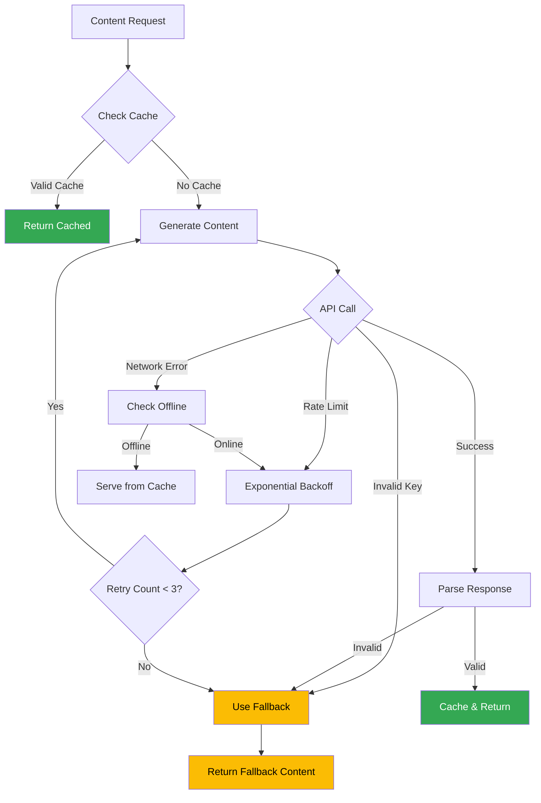

# Design Document

## Overview

This design document outlines the architecture for DeepTime's redesigned AI integration system. The system leverages Gemini 2.5 Flash for text generation, Gemini 2.5 Flash Image for visual content, and Veo 3.1 for video generation, while implementing intelligent caching strategies to minimize API costs and maximize user experience.

The core principle is **generate once, cache forever** - content is generated once per location-era combination and persisted with a 30-day TTL. Users can manually refresh content when they want variations, but the default behavior prioritizes cost efficiency and fast load times.

## Architecture

### High-Level System Architecture



### Data Flow Architecture



## Components and Interfaces

### 1. Content Orchestrator

**Purpose**: Coordinates content generation, caching, and delivery

**Interface**:
```typescript
interface ContentOrchestrator {
  /**
   * Get complete content for a location-era combination
   * Returns cached content if available, generates if not
   */
  getContent(
    location: GeoCoordinate,
    era: GeologicalLayer
  ): Promise<EraContent>;
  
  /**
   * Invalidate cache and regenerate content
   */
  refreshContent(
    location: GeoCoordinate,
    era: GeologicalLayer
  ): Promise<EraContent>;
  
  /**
   * Preload content for adjacent eras
   */
  preloadAdjacentEras(
    location: GeoCoordinate,
    currentEra: GeologicalLayer
  ): Promise<void>;
}

interface EraContent {
  narrative: EnhancedNarrative;
  image: GeneratedImage | null;
  video: GeneratedVideo | null;
  cacheMetadata: CacheMetadata;
}
```

### 2. Text Generator

**Purpose**: Generates location-aware narratives using Gemini 2.5 Flash

**Interface**:
```typescript
interface TextGenerator {
  /**
   * Generate narrative for a location-era combination
   * Uses Gemini 2.5 Flash with implicit caching
   */
  generateNarrative(
    location: GeoCoordinate,
    layer: GeologicalLayer,
    options?: GenerationOptions
  ): Promise<EnhancedNarrative>;
}

interface EnhancedNarrative extends Narrative {
  locationContext: LocationContext;
  generatedAt: Date;
  modelUsed: string;
  tokenCount: TokenUsage;
}

interface LocationContext {
  coordinates: GeoCoordinate;
  placeName: string;
  geologicalFeatures: string[];
  nearbyLandmarks: string[];
}

interface TokenUsage {
  inputTokens: number;
  outputTokens: number;
  cachedTokens: number;
  totalCost: number;
}
```

### 3. Image Generator

**Purpose**: Generates era visualization images using Gemini 2.5 Flash Image

**Interface**:
```typescript
interface ImageGenerator {
  /**
   * Generate image for a location-era combination
   * Uses Gemini 2.5 Flash Image with MEDIUM resolution
   */
  generateImage(
    location: GeoCoordinate,
    layer: GeologicalLayer,
    narrative: EnhancedNarrative,
    options?: ImageGenerationOptions
  ): Promise<GeneratedImage>;
}

interface GeneratedImage {
  id: string;
  imageData: Blob;
  mimeType: string;
  width: number;
  height: number;
  prompt: string;
  generatedAt: Date;
  modelUsed: string;
  resolution: MediaResolution;
  cost: number;
}

interface ImageGenerationOptions {
  resolution?: MediaResolution;
  aspectRatio?: '16:9' | '4:3' | '1:1';
  style?: 'photorealistic' | 'artistic' | 'scientific';
}

type MediaResolution = 'LOW' | 'MEDIUM' | 'HIGH';
```

### 4. Video Generator

**Purpose**: Generates short video clips using Veo 3.1 Fast

**Interface**:
```typescript
interface VideoGenerator {
  /**
   * Generate video for a location-era combination
   * Uses Veo 3.1 Fast for 4-6 second clips
   * Returns operation handle for async polling
   */
  generateVideo(
    location: GeoCoordinate,
    layer: GeologicalLayer,
    narrative: EnhancedNarrative,
    image?: GeneratedImage,
    options?: VideoGenerationOptions
  ): Promise<VideoOperation>;
  
  /**
   * Poll video generation status
   */
  pollVideoStatus(operation: VideoOperation): Promise<GeneratedVideo | null>;
}

interface VideoOperation {
  operationId: string;
  status: 'pending' | 'processing' | 'complete' | 'failed';
  estimatedCompletion: Date;
  progress: number; // 0-100
}

interface GeneratedVideo {
  id: string;
  videoData: Blob;
  mimeType: string;
  duration: number; // seconds
  width: number;
  height: number;
  prompt: string;
  generatedAt: Date;
  modelUsed: string;
  cost: number;
}

interface VideoGenerationOptions {
  duration?: 4 | 6 | 8;
  resolution?: '720p' | '1080p';
  useImageAsFirstFrame?: boolean;
}
```

### 5. Cache Manager

**Purpose**: Manages content persistence with TTL and LRU eviction

**Interface**:
```typescript
interface CacheManager {
  /**
   * Get cached content for location-era
   */
  getContent(
    location: GeoCoordinate,
    era: GeologicalLayer
  ): Promise<CachedEraContent | null>;
  
  /**
   * Store content with TTL
   */
  storeContent(
    location: GeoCoordinate,
    era: GeologicalLayer,
    content: EraContent
  ): Promise<void>;
  
  /**
   * Invalidate specific cache entry
   */
  invalidate(
    location: GeoCoordinate,
    era: GeologicalLayer
  ): Promise<void>;
  
  /**
   * Check if cache entry is valid (not expired)
   */
  isValid(metadata: CacheMetadata): boolean;
  
  /**
   * Evict old entries when storage limit reached
   */
  evictOldEntries(): Promise<void>;
  
  /**
   * Get cache statistics
   */
  getStats(): Promise<CacheStats>;
}

interface CachedEraContent {
  content: EraContent;
  metadata: CacheMetadata;
}

interface CacheMetadata {
  cacheKey: string;
  cachedAt: Date;
  expiresAt: Date;
  lastAccessed: Date;
  size: number; // bytes
  version: number;
}

interface CacheStats {
  totalEntries: number;
  totalSize: number;
  hitRate: number;
  oldestEntry: Date;
  newestEntry: Date;
}
```

### 6. Prompt Builder

**Purpose**: Constructs optimized prompts for AI models

**Interface**:
```typescript
interface PromptBuilder {
  /**
   * Build narrative prompt with location context
   */
  buildNarrativePrompt(
    location: GeoCoordinate,
    layer: GeologicalLayer,
    locationContext: LocationContext
  ): string;
  
  /**
   * Build image generation prompt
   */
  buildImagePrompt(
    location: GeoCoordinate,
    layer: GeologicalLayer,
    narrative: EnhancedNarrative
  ): string;
  
  /**
   * Build video generation prompt
   */
  buildVideoPrompt(
    location: GeoCoordinate,
    layer: GeologicalLayer,
    narrative: EnhancedNarrative
  ): string;
  
  /**
   * Get reusable context prefix for implicit caching
   */
  getContextPrefix(location: GeoCoordinate): string;
}
```

## Data Models

### Enhanced Type Definitions

```typescript
// Extend existing types with AI-generated content

interface AIGeneratedContent {
  text: EnhancedNarrative;
  image: GeneratedImage | null;
  video: GeneratedVideo | null;
  generationMetadata: GenerationMetadata;
}

interface GenerationMetadata {
  generatedAt: Date;
  location: GeoCoordinate;
  era: GeologicalLayer;
  totalCost: number;
  totalTokens: number;
  generationDuration: number; // milliseconds
  modelsUsed: string[];
}

// Cache storage schema
interface CacheEntry {
  key: string; // `${lat}_${lon}_${eraId}`
  content: AIGeneratedContent;
  metadata: CacheMetadata;
}

// IndexedDB schema
interface DeepTimeCacheDB {
  eraContent: {
    key: string;
    value: CacheEntry;
    indexes: {
      location: string;
      era: string;
      cachedAt: Date;
      expiresAt: Date;
    };
  };
  
  mediaBlobs: {
    key: string; // image or video ID
    value: {
      id: string;
      type: 'image' | 'video';
      data: Blob;
      metadata: Record<string, unknown>;
    };
  };
  
  costTracking: {
    key: string; // date string YYYY-MM-DD
    value: {
      date: string;
      textCost: number;
      imageCost: number;
      videoCost: number;
      totalCost: number;
      apiCalls: number;
      cacheHits: number;
    };
  };
}
```

## Correctness Properties

*A property is a characteristic or behavior that should hold true across all valid executions of a system-essentially, a formal statement about what the system should do. Properties serve as the bridge between human-readable specifications and machine-verifiable correctness guarantees.*

## Correctness Properties (Continued from design.md)

### Location-Aware Content Generation Properties

**Property 1: Location-specific geological data retrieval**
*For any* valid geographic coordinates, retrieving geological data should return data that matches those exact coordinates
**Validates: Requirements 1.1**

**Property 2: Geological metadata in prompts**
*For any* location and geological layer, the generated prompt should contain the layer's material type, fossil index, era name, and period
**Validates: Requirements 1.2**

**Property 3: Cache reuse for same location**
*For any* location-era combination, multiple requests should result in only one API call, with subsequent requests served from cache
**Validates: Requirements 1.3**

**Property 4: Unique content per era**
*For any* location with multiple geological layers, content generated for different eras should be distinct (different narratives, images, videos)
**Validates: Requirements 1.4**

**Property 5: Geological details in content**
*For any* generated narrative, the text should mention the material type and fossil index from the input layer
**Validates: Requirements 1.5**

### Cost-Optimized Text Generation Properties

**Property 6: Cache storage with TTL**
*For any* generated content, it should be stored in IndexedDB with an expiration date 30 days in the future
**Validates: Requirements 2.2**

**Property 7: Cache hit avoids API calls**
*For any* valid cached content (not expired), requesting that content should not trigger an API call
**Validates: Requirements 2.3**

**Property 8: Cache miss triggers generation**
*For any* expired or missing cache entry, requesting content should trigger new generation and cache update
**Validates: Requirements 2.4**

**Property 9: Context prefix for implicit caching**
*For any* generated prompt, it should start with the reusable context prefix containing location and geological data
**Validates: Requirements 2.6**

### Image Generation Properties

**Property 10: Image generation or retrieval**
*For any* location-era combination, requesting an image should return either a cached image or generate a new one
**Validates: Requirements 3.1**

**Property 11: Image prompt completeness**
*For any* image generation prompt, it should include flora, fauna, climate description, and geological features from the narrative
**Validates: Requirements 3.3**

**Property 12: Image caching**
*For any* generated image, it should be stored in IndexedDB with image data, metadata, and cache key
**Validates: Requirements 3.4**

**Property 13: Image cache hit**
*For any* cached image that is valid, requesting that image should not trigger new generation
**Validates: Requirements 3.5**

### Video Generation Properties

**Property 14: Video duration range**
*For any* generated video, its duration should be between 4 and 6 seconds (inclusive)
**Validates: Requirements 4.1**

**Property 15: Video prompt location-specificity**
*For any* video generation prompt, it should include location name, era name, and narrative elements
**Validates: Requirements 4.2**

**Property 16: Video caching**
*For any* generated video, it should be stored in IndexedDB with video data, metadata, and cache key
**Validates: Requirements 4.3**

**Property 17: Video cache hit**
*For any* cached video that is valid, requesting that video should not trigger new generation
**Validates: Requirements 4.4**

### Cache Management Properties

**Property 18: Cache key format**
*For any* cached content, its cache key should follow the format `${latitude}_${longitude}_${eraId}`
**Validates: Requirements 5.1**

**Property 19: TTL validation**
*For any* cache entry, checking if it's valid should return false if current time exceeds the expiration date
**Validates: Requirements 5.2**

**Property 20: LRU eviction**
*For any* cache that exceeds 50MB, the eviction process should remove entries with the oldest lastAccessed timestamp first
**Validates: Requirements 5.3**

**Property 21: Cache invalidation on refresh**
*For any* location-era combination, requesting a refresh should delete the cache entry and trigger new generation
**Validates: Requirements 5.4**

**Property 22: Offline cache-only behavior**
*For any* request when the device is offline, the system should serve content from cache without attempting API calls
**Validates: Requirements 5.5**

### User-Controlled Refresh Properties

**Property 23: Refresh invalidates cache**
*For any* location-era combination, triggering refresh should remove the cache entry for that specific combination
**Validates: Requirements 6.2**

**Property 24: Refresh produces different content**
*For any* location-era combination, generating content twice (after refresh) should produce different narratives, images, or videos
**Validates: Requirements 6.3**

### Prompt Engineering Properties

**Property 25: Context at prompt beginning**
*For any* generated prompt, the first 1024 tokens should contain the reusable geological and location context
**Validates: Requirements 7.1**

**Property 26: Prompt prefix consistency**
*For any* two prompts for the same location, they should share an identical prefix containing location and geological context
**Validates: Requirements 7.2**

**Property 27: Token efficiency**
*For any* prompt with output format instructions, the instructions should be ≤100 tokens
**Validates: Requirements 7.3**

**Property 28: Few-shot example limit**
*For any* prompt containing examples, it should have ≤3 few-shot examples
**Validates: Requirements 7.5**

### Context Caching Properties

**Property 29: Prompt structure for cache hits**
*For any* two prompts for the same location, they should have identical prefixes to maximize implicit cache hit rate
**Validates: Requirements 8.2**

**Property 30: Cache hit logging**
*For any* API response with cached tokens, the system should log the cached token count
**Validates: Requirements 8.3**

**Property 31: Explicit cache creation**
*For any* location with geological data >4096 tokens, the system should create an explicit cached content object
**Validates: Requirements 8.4**

### Graceful Degradation Properties

**Property 32: Fallback on generation failure**
*For any* failed text generation attempt, the system should return a pre-written narrative from the core library
**Validates: Requirements 9.1**

**Property 33: No API calls without key**
*For any* request when API key is missing or invalid, the system should use fallback content without making API calls
**Validates: Requirements 9.4**

**Property 34: Exponential backoff on rate limits**
*For any* rate limit error, the system should retry with exponentially increasing delays (1s, 2s, 4s, 8s, ...)
**Validates: Requirements 9.5**

### Content Persistence Properties

**Property 35: Immediate persistence**
*For any* generated content, it should be present in IndexedDB within 1 second of generation completion
**Validates: Requirements 10.1**

**Property 36: Cache load on startup**
*For any* app initialization, cached content should be loaded from IndexedDB before making new API calls
**Validates: Requirements 10.2**

**Property 37: Firestore sync excludes blobs**
*For any* content synced to Firestore, the document should contain metadata and URLs but not image/video Blob data
**Validates: Requirements 10.4**

**Property 38: Local storage after Firestore load**
*For any* content loaded from Firestore, media files should be downloaded and stored in IndexedDB
**Validates: Requirements 10.5**

### Cost Monitoring Properties

**Property 39: Token count logging**
*For any* API call, the system should log input tokens, output tokens, and cached tokens
**Validates: Requirements 11.1**

**Property 40: Cache hit event logging**
*For any* content served from cache, the system should log a cache hit event with timestamp and cache key
**Validates: Requirements 11.2**

**Property 41: Image cost logging**
*For any* generated image, the system should log the cost based on resolution (MEDIUM = ~$0.039 per image)
**Validates: Requirements 11.3**

**Property 42: Video cost logging**
*For any* generated video, the system should log the cost based on duration (Veo 3.1 Fast = $0.15 per second)
**Validates: Requirements 11.4**

**Property 43: Usage threshold alerts**
*For any* day where total cost exceeds the defined threshold, the system should log an alert event
**Validates: Requirements 11.5**

### Progressive Enhancement Properties

**Property 44: Text-first loading on slow connections**
*For any* request when connection speed is slow, text content should be loaded and displayed before images and videos
**Validates: Requirements 12.2**

**Property 45: On-demand media loading**
*For any* media item with a "Load" button, tapping the button should fetch and display that specific media
**Validates: Requirements 12.4**

**Property 46: Cached media loads immediately**
*For any* media that exists in cache, it should be displayed immediately regardless of connection speed
**Validates: Requirements 12.5**
# Design Document (Continued)

## Error Handling

### Error Types and Recovery Strategies

```typescript
type AIErrorType =
  | 'api_error'           // Gemini/Veo API failure
  | 'rate_limit'          // API rate limit exceeded
  | 'invalid_key'         // API key missing or invalid
  | 'parse_error'         // Response parsing failure
  | 'cache_error'         // IndexedDB operation failure
  | 'network_error'       // Network connectivity issue
  | 'generation_timeout'; // Generation took too long

interface ErrorRecoveryStrategy {
  errorType: AIErrorType;
  fallbackBehavior: 'use_cache' | 'use_fallback' | 'retry' | 'fail_gracefully';
  retryConfig?: {
    maxAttempts: number;
    backoffMs: number[];
  };
}
```

### Error Handling Flow



### Specific Error Handlers

**1. Rate Limit Handler**
```typescript
async function handleRateLimit(
  operation: () => Promise<T>,
  maxRetries: number = 3
): Promise<T> {
  const backoffMs = [1000, 2000, 4000, 8000];
  
  for (let attempt = 0; attempt < maxRetries; attempt++) {
    try {
      return await operation();
    } catch (error) {
      if (error.status === 429 && attempt < maxRetries - 1) {
        await sleep(backoffMs[attempt]);
        continue;
      }
      throw error;
    }
  }
  
  throw new Error('Max retries exceeded');
}
```

**2. Fallback Content Provider**
```typescript
interface FallbackProvider {
  getNarrativeFallback(layer: GeologicalLayer): EnhancedNarrative;
  getImageFallback(era: string): GeneratedImage;
  // No video fallback - hide video section on failure
}
```

## Testing Strategy

### Unit Testing

**Text Generator Tests**:
- Test prompt construction with various geological layers
- Test token counting and cost calculation
- Test fallback behavior on API errors
- Test cache integration

**Image Generator Tests**:
- Test image prompt construction
- Test resolution parameter handling
- Test blob storage and retrieval
- Test fallback placeholder images

**Video Generator Tests**:
- Test async operation handling
- Test polling mechanism
- Test duration validation (4-6 seconds)
- Test graceful failure (hide section)

**Cache Manager Tests**:
- Test TTL validation
- Test LRU eviction algorithm
- Test cache key generation
- Test storage limit enforcement

### Property-Based Testing

The system will use `fast-check` for property-based testing. Each correctness property from the design will be implemented as a property-based test with 100+ iterations.

**Property Testing Framework**:
```typescript
import fc from 'fast-check';

// Example: Property 1 - Location-specific data retrieval
fc.assert(
  fc.asyncProperty(
    geoCoordinateArbitrary(),
    async (location) => {
      const data = await geologicalDataService.fetchGeology(location);
      return (
        Math.abs(data.location.latitude - location.latitude) < 0.00001 &&
        Math.abs(data.location.longitude - location.longitude) < 0.00001
      );
    }
  ),
  { numRuns: 100 }
);
```

**Custom Arbitraries**:
```typescript
// Generate random valid coordinates
const geoCoordinateArbitrary = () =>
  fc.record({
    latitude: fc.double({ min: -90, max: 90 }),
    longitude: fc.double({ min: -180, max: 180 }),
    altitude: fc.double({ min: 0, max: 10000 }),
    accuracy: fc.double({ min: 0, max: 100 }),
  });

// Generate random geological layers
const geologicalLayerArbitrary = () =>
  fc.record({
    id: fc.uuid(),
    depthStart: fc.nat(1000),
    depthEnd: fc.nat(1000),
    material: fc.constantFrom('limestone', 'granite', 'shale', 'sandstone'),
    era: eraArbitrary(),
    fossilIndex: fc.constantFrom('none', 'low', 'medium', 'high', 'exceptional'),
  });
```

### Integration Testing

**End-to-End Content Generation Flow**:
1. Request content for a location-era
2. Verify cache miss triggers generation
3. Verify all three content types are generated (text, image, video)
4. Verify content is cached
5. Request same content again
6. Verify cache hit (no API calls)

**Offline Behavior Testing**:
1. Generate and cache content while online
2. Simulate offline state
3. Request cached content
4. Verify content is served from cache
5. Verify no API calls attempted

**Refresh Flow Testing**:
1. Generate and cache content
2. Trigger refresh
3. Verify cache invalidation
4. Verify new content is generated
5. Verify new content differs from original

## Performance Considerations

### Optimization Strategies

**1. Implicit Caching Optimization**
- Place geological context at the beginning of all prompts
- Use consistent formatting for location data
- Reuse prompt prefixes across multiple requests
- Expected savings: 50% on input tokens for repeated locations

**2. Lazy Video Generation**
- Generate text and image immediately
- Start video generation asynchronously
- Display text + image while video loads
- Update UI when video completes
- Benefit: Faster perceived load time

**3. Preloading Adjacent Eras**
- When user views an era, preload content for previous/next eras
- Use idle time for background generation
- Benefit: Instant navigation between eras

**4. Progressive Image Loading**
- Generate LOW resolution image first (fast, cheap)
- Display immediately
- Generate MEDIUM resolution in background
- Replace when ready
- Benefit: Faster initial display

**5. Batch Operations**
- When loading a location, batch all era generations
- Use Promise.all for parallel execution
- Benefit: Reduced total wait time

### Performance Targets

| Operation | Target | Measurement |
|-----------|--------|-------------|
| Cache hit (text) | <100ms | Time to display narrative |
| Cache hit (image) | <200ms | Time to display image |
| Cache hit (video) | <500ms | Time to start video playback |
| Text generation | <2s | API call + parsing |
| Image generation | <5s | API call + blob creation |
| Video generation | <30s | Async operation completion |
| Cache write | <500ms | IndexedDB transaction |
| LRU eviction | <1s | Remove old entries |

## Security Considerations

### API Key Management

**Storage**: 
- Store in localStorage (client-side only)
- Never log or transmit to analytics
- Clear on logout

**Validation**:
- Validate format before use
- Test with simple API call
- Handle invalid key gracefully

**Rate Limiting**:
- Implement client-side rate limiting
- Track API calls per minute/day
- Warn user before hitting limits

### Content Security

**Generated Content Validation**:
- Sanitize all AI-generated text before display
- Validate image/video MIME types
- Check file sizes before caching
- Reject suspicious content

**Cache Security**:
- Use IndexedDB (origin-isolated)
- No sensitive data in cache
- Clear cache on security events

## Cost Analysis

### Pricing Breakdown (Per Location-Era)

**Text Generation (Gemini 2.5 Flash)**:
- Input: ~500 tokens (geological data + prompt) = $0.00015
- Output: ~300 tokens (narrative JSON) = $0.00075
- Cached input (subsequent): ~400 tokens = $0.00004
- **Total per generation**: ~$0.0009
- **Total with caching**: ~$0.00034 (62% savings)

**Image Generation (Gemini 2.5 Flash Image)**:
- MEDIUM resolution: ~$0.039 per image
- **Total per generation**: $0.039

**Video Generation (Veo 3.1 Fast)**:
- 5 seconds @ $0.15/second = $0.75
- **Total per generation**: $0.75

**Total Cost Per Location-Era**:
- First generation: $0.0009 + $0.039 + $0.75 = **$0.7899**
- Cached (30 days): $0.00 (no API calls)
- Refresh: Same as first generation

**Monthly Cost Estimates**:

Scenario: 1000 active users, 5 locations each, 3 eras per location

- Total unique location-eras: 15,000
- First month (all new): 15,000 × $0.79 = **$11,850**
- Subsequent months (90% cached): 1,500 × $0.79 = **$1,185**
- With refresh (10% refresh rate): +$1,185 = **$2,370/month**

**Cost Optimization Impact**:
- Without caching: $11,850/month
- With caching: $2,370/month
- **Savings: 80%**

## Deployment Strategy

### Phased Rollout

**Phase 1: Text Only (Week 1-2)**
- Deploy text generation with caching
- Monitor costs and performance
- Gather user feedback
- Validate caching strategy

**Phase 2: Add Images (Week 3-4)**
- Deploy image generation
- Test progressive loading
- Monitor storage usage
- Optimize image prompts

**Phase 3: Add Videos (Week 5-6)**
- Deploy video generation
- Test async operations
- Monitor video costs
- Implement usage limits

**Phase 4: Optimization (Week 7-8)**
- Implement preloading
- Optimize prompt templates
- Fine-tune cache TTLs
- Add cost monitoring dashboard

### Monitoring and Alerts

**Key Metrics**:
- API calls per day
- Cache hit rate
- Average generation time
- Total daily cost
- Storage usage
- Error rate by type

**Alerts**:
- Daily cost exceeds $100
- Cache hit rate below 70%
- Error rate above 5%
- Storage usage above 80%
- Rate limit warnings

## Future Enhancements

### Planned Features

**1. Personalized Content**
- User preference tracking
- Adaptive difficulty levels
- Interest-based narratives

**2. Multi-Language Support**
- Translate narratives
- Localized image prompts
- Regional geological terms

**3. Voice Narration**
- Text-to-speech integration
- Multiple voice options
- Offline voice synthesis

**4. Social Sharing**
- Share generated content
- Community galleries
- User-generated variations

**5. Advanced Caching**
- Predictive preloading
- Smart eviction based on user patterns
- Cross-device sync optimization

### Research Areas

**1. Prompt Optimization**
- A/B test different prompt templates
- Measure quality vs. token usage
- Optimize for implicit caching

**2. Cost Reduction**
- Explore batch API for bulk generation
- Test lower resolution options
- Investigate model fine-tuning

**3. Quality Improvement**
- Collect user ratings
- Identify common failure modes
- Refine fallback content

## Appendix

### A. Prompt Templates

**Narrative Prompt Template**:
```
[CONTEXT - Reusable for implicit caching]
Location: {placeName} ({latitude}, {longitude})
Geological Setting: {geologicalFeatures}
Nearby Landmarks: {landmarks}

[LAYER DATA]
Era: {era.name} ({yearsAgo} years ago)
Period: {era.period}
Material: {material}
Fossil Index: {fossilIndex}
Depth: {depthStart}m to {depthEnd}m

[INSTRUCTION]
Generate a vivid narrative describing this location during the {era.name} era.
Include specific flora (3-5 species), fauna (3-5 species), and climate details.

Return JSON:
{
  "shortDescription": "2-3 sentences",
  "flora": ["species1", "species2", ...],
  "fauna": ["species1", "species2", ...],
  "climate": {
    "temperature": "description",
    "humidity": "description",
    "atmosphere": "description"
  }
}
```

**Image Prompt Template**:
```
Create a photorealistic landscape image showing {placeName} during the {era.name} era, {yearsAgo} years ago.

Setting: {climate.temperature} climate, {climate.humidity} conditions, {climate.atmosphere} atmosphere.

Flora: {flora.join(', ')}
Fauna: {fauna.join(', ')}

Style: Cinematic, wide-angle view, golden hour lighting, scientifically accurate.
Composition: Foreground with {fauna[0]}, midground with {flora[0]}, background with {geologicalFeatures}.
```

**Video Prompt Template**:
```
A cinematic 5-second video showing {placeName} during the {era.name} era.

Scene: {shortDescription}

Camera: Slow dolly shot, starting wide and moving closer to reveal {fauna[0]} in its natural habitat.

Environment: {climate.temperature}, {flora[0]} and {flora[1]} vegetation, {geologicalFeatures} in background.

Mood: Serene, prehistoric, educational.
```

### B. Cache Key Examples

```
Location: 37.7749, -122.4194 (San Francisco)
Era: Cretaceous (layer ID: cret_001)
Cache Key: 37.77490_-122.41940_cret_001

Location: 51.5074, -0.1278 (London)
Era: Jurassic (layer ID: jur_002)
Cache Key: 51.50740_-0.12780_jur_002
```

### C. Cost Calculation Formulas

```typescript
// Text generation cost
function calculateTextCost(inputTokens: number, outputTokens: number, cachedTokens: number): number {
  const INPUT_COST_PER_1M = 0.30;  // Gemini 2.5 Flash
  const OUTPUT_COST_PER_1M = 2.50;
  const CACHED_COST_PER_1M = 0.075; // 75% discount
  
  const inputCost = (inputTokens - cachedTokens) * (INPUT_COST_PER_1M / 1_000_000);
  const cachedCost = cachedTokens * (CACHED_COST_PER_1M / 1_000_000);
  const outputCost = outputTokens * (OUTPUT_COST_PER_1M / 1_000_000);
  
  return inputCost + cachedCost + outputCost;
}

// Image generation cost
function calculateImageCost(resolution: MediaResolution): number {
  const costs = {
    LOW: 0.02,
    MEDIUM: 0.039,
    HIGH: 0.08,
  };
  return costs[resolution];
}

// Video generation cost
function calculateVideoCost(durationSeconds: number, model: 'standard' | 'fast'): number {
  const costPerSecond = model === 'fast' ? 0.15 : 0.40;
  return durationSeconds * costPerSecond;
}
```

---

**Document Version**: 1.0  
**Last Updated**: December 5, 2025  
**Status**: Draft - Pending Review
