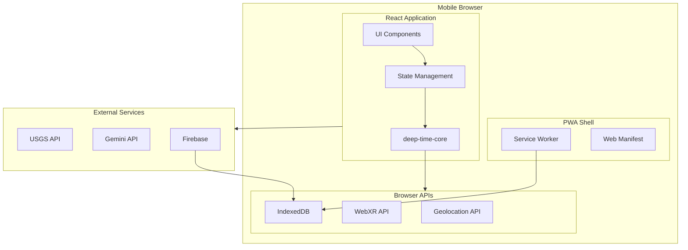
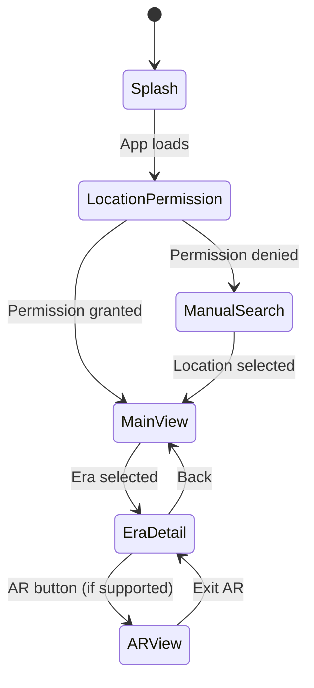

# DeepTime PWA Design Document

## Overview

DeepTime PWA is a Progressive Web Application that brings geological time-travel to mobile browsers. Built with React + TypeScript + Vite, it leverages the existing deep-time-core library for business logic while adding a responsive UI, Gemini AI integration, Firebase backend, and optional WebXR AR visualization.

The architecture prioritizes hackathon speed: reuse core logic, minimal dependencies, and graceful degradation for devices without AR support.

## Architecture



## Tech Stack

| Layer | Technology | Rationale |
|-------|------------|-----------|
| Framework | React 18 | Familiar, fast dev, great ecosystem |
| Build | Vite | Fast HMR, easy PWA plugin |
| Styling | Tailwind CSS | Rapid UI development |
| State | Zustand | Simple, no boilerplate |
| AR | WebXR + Three.js | Browser-native AR |
| Backend | Firebase | Auth, Firestore, easy setup |
| AI | Gemini API | User's preference |
| Core Logic | deep-time-core | Reuse existing library |

## Components and Interfaces

### 1. App Shell

```typescript
// Main app structure
interface AppState {
  location: GeoCoordinate | null;
  geologicalStack: GeologicalStack | null;
  currentEra: GeologicalEra | null;
  timePosition: number; // yearsAgo
  narrative: Narrative | null;
  isLoading: boolean;
  error: string | null;
  isOffline: boolean;
  viewMode: 'card' | 'ar';
}
```

### 2. Location Service

```typescript
interface LocationService {
  // Get current GPS position
  getCurrentPosition(): Promise<GeoCoordinate>;
  
  // Search for location by name
  searchLocation(query: string): Promise<GeoCoordinate[]>;
  
  // Check if geolocation is available
  isAvailable(): boolean;
}
```

### 3. Geological Data Service

```typescript
interface GeologicalDataService {
  // Fetch geological data from USGS
  fetchGeology(location: GeoCoordinate): Promise<GeologicalStack>;
  
  // Get cached data for location
  getCached(location: GeoCoordinate): Promise<GeologicalStack | null>;
  
  // Cache geological data
  cache(location: GeoCoordinate, data: GeologicalStack): Promise<void>;
}
```

### 4. Narrative Service (Gemini Integration)

```typescript
interface NarrativeService {
  // Generate narrative using Gemini
  generateNarrative(layer: GeologicalLayer): Promise<Narrative>;
  
  // Get fallback narrative for era
  getFallback(era: GeologicalEra): Narrative;
}

// Gemini prompt template
const NARRATIVE_PROMPT = `
You are a geological storyteller. Given this layer data:
- Era: {era.name} ({era.yearsAgo} years ago)
- Material: {material}
- Fossil Index: {fossilIndex}
- Depth: {depthStart}m to {depthEnd}m

Generate a vivid, engaging narrative (2-3 sentences) describing what this location looked like during this era. Include specific flora, fauna, and climate details. Return JSON:
{
  "shortDescription": "...",
  "flora": ["plant1", "plant2"],
  "fauna": ["creature1", "creature2"],
  "climate": { "temperature": "...", "humidity": "...", "atmosphere": "..." }
}
`;
```

### 5. Firebase Service

```typescript
interface FirebaseService {
  // Store location data
  saveLocation(userId: string, data: CachedLocation): Promise<void>;
  
  // Get user's cached locations
  getLocations(userId: string): Promise<CachedLocation[]>;
  
  // Delete cached location
  deleteLocation(userId: string, locationId: string): Promise<void>;
}
```

### 6. UI Components

```typescript
// Main screen components
interface ComponentProps {
  TimeSlider: {
    value: number;
    onChange: (yearsAgo: number) => void;
    eraBoundaries: EraBoundary[];
  };
  
  EraCard: {
    era: GeologicalEra;
    narrative: Narrative | null;
    isLoading: boolean;
  };
  
  LocationHeader: {
    location: GeoCoordinate | null;
    onSearch: () => void;
  };
  
  ARView: {
    era: GeologicalEra;
    narrative: Narrative;
    onExit: () => void;
  };
}
```

## Screen Flow



## Data Models

Reuses types from deep-time-core:
- `GeoCoordinate`
- `GeologicalStack`
- `GeologicalLayer`
- `GeologicalEra`
- `Narrative`
- `CachedLocation`

## Correctness Properties

*A property is a characteristic or behavior that should hold true across all valid executions of a system-essentially, a formal statement about what the system should do. Properties serve as the bridge between human-readable specifications and machine-verifiable correctness guarantees.*

### Property 1: Geological Query Triggers on Location

*For any* valid GPS coordinate obtained, the app SHALL initiate a query to the geological data service.

**Validates: Requirements 1.2**

### Property 2: Layer Stack Ordering

*For any* geological API response, the constructed stack SHALL have layers ordered by increasing depth (inherited from core library).

**Validates: Requirements 1.3**

### Property 3: Narrative Contains Required Fields

*For any* Gemini API response, the displayed narrative SHALL contain non-empty flora array, fauna array, and climate description.

**Validates: Requirements 2.2**

### Property 4: High Fossil Emphasis

*For any* layer with fossilIndex 'high' or 'exceptional', the narrative SHALL contain at least 3 creature types in fauna array.

**Validates: Requirements 2.3**

### Property 5: Firebase Cache on Success

*For any* successfully generated narrative, a Firebase write operation SHALL be initiated.

**Validates: Requirements 2.5**

### Property 6: Time Slider Era Mapping

*For any* slider position, the displayed era label SHALL correctly correspond to the geological era containing that yearsAgo value.

**Validates: Requirements 3.2**

### Property 7: Slider Direction Consistency

*For any* downward slider movement (increasing value), the yearsAgo SHALL increase (going deeper in time).

**Validates: Requirements 3.3**

### Property 8: Era-Appropriate Visuals

*For any* selected era, the displayed background/scene SHALL match the era's time period (prehistoric shows creatures, recent shows historical context).

**Validates: Requirements 4.1, 4.2, 4.3**

### Property 9: WebXR Graceful Degradation

*For any* device without WebXR support, the app SHALL render 2D card visualization without errors.

**Validates: Requirements 4.5**

### Property 10: Cache Persistence

*For any* completed location scan, geological data SHALL be retrievable from cache on subsequent visits.

**Validates: Requirements 5.1, 5.2**

## Error Handling

| Error | User Experience |
|-------|-----------------|
| GPS denied | Show search bar for manual entry |
| USGS API fails | Show cached data or friendly error with retry |
| Gemini API fails | Show fallback era description |
| Offline | Show cached locations with offline badge |
| WebXR unavailable | Hide AR button, show 2D view |

## Testing Strategy

### Property-Based Testing

Uses **fast-check** (already configured in core). Key properties to test:
- Slider position → era mapping consistency
- Narrative field completeness
- Cache round-trip integrity

### Unit Tests

- Component rendering
- Service mocking for API calls
- State transitions

### E2E Tests (Optional)

- Playwright for web flows (not AR)

## Project Structure

```
deep-time-app/
├── public/
│   ├── manifest.json
│   ├── sw.js
│   └── icons/
├── src/
│   ├── components/
│   │   ├── TimeSlider.tsx
│   │   ├── EraCard.tsx
│   │   ├── LocationHeader.tsx
│   │   ├── ARView.tsx
│   │   └── LoadingSpinner.tsx
│   ├── services/
│   │   ├── location.ts
│   │   ├── geological.ts
│   │   ├── narrative.ts
│   │   └── firebase.ts
│   ├── store/
│   │   └── appStore.ts
│   ├── hooks/
│   │   └── useGeolocation.ts
│   ├── pages/
│   │   ├── Home.tsx
│   │   └── EraDetail.tsx
│   ├── App.tsx
│   └── main.tsx
├── package.json
├── vite.config.ts
├── tailwind.config.js
└── tsconfig.json
```

