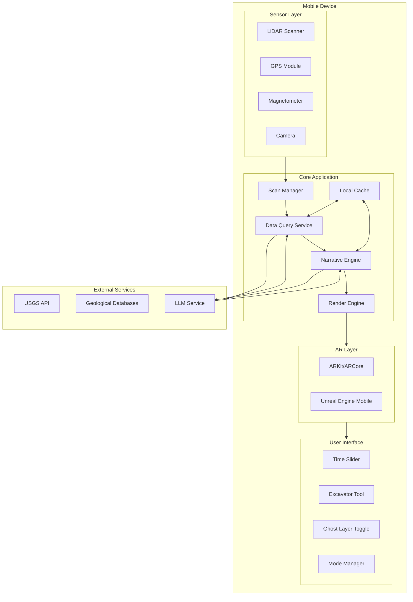

# DeepTime Design Document

## Overview

DeepTime is a mobile AR application that enables users to visualize geological and historical layers beneath their current location. The system integrates hardware sensors (LiDAR, magnetometer, GPS), external geological databases, AI-powered narrative generation, and real-time AR rendering to create an immersive "vertical time travel" experience.

The architecture follows a pipeline pattern: Scan → Query → Interpret → Render, with each stage operating asynchronously to minimize perceived latency. The system supports three industry modes (Construction, Education, Environmental) that customize the visualization and data priorities.

## Architecture



## Components and Interfaces

### 1. Scan Manager

Coordinates sensor data acquisition and initiates the data pipeline.

```typescript
interface ScanManager {
  // Initiates a ground scan at current location
  startScan(): Promise<ScanResult>;
  
  // Cancels an in-progress scan
  cancelScan(): void;
  
  // Returns current scan status
  getStatus(): ScanStatus;
}

interface ScanResult {
  id: string;
  timestamp: Date;
  location: GeoCoordinate;
  lidarData: LiDARPointCloud | null;
  magnetometerReadings: MagnetometerData[];
  deviceCapabilities: DeviceCapabilities;
}

interface GeoCoordinate {
  latitude: number;
  longitude: number;
  altitude: number;
  accuracy: number;
}

type ScanStatus = 'idle' | 'scanning' | 'processing' | 'complete' | 'error';
```

### 2. Data Query Service

Manages communication with geological databases and caching.

```typescript
interface DataQueryService {
  // Queries geological data for a location
  queryGeology(location: GeoCoordinate): Promise<GeologicalStack>;
  
  // Checks cache for existing data
  getCachedData(location: GeoCoordinate): GeologicalStack | null;
  
  // Persists geological data to cache
  cacheData(location: GeoCoordinate, data: GeologicalStack): Promise<void>;
}

interface GeologicalStack {
  location: GeoCoordinate;
  layers: GeologicalLayer[];
  queryTimestamp: Date;
  dataSource: string;
  confidence: number;
}

interface GeologicalLayer {
  id: string;
  depthStart: number;  // meters below surface
  depthEnd: number;
  material: MaterialType;
  era: GeologicalEra;
  period: string;
  fossilIndex: FossilIndex;
  characteristics: LayerCharacteristics;
}

type MaterialType = 'soil' | 'clay' | 'sand' | 'limestone' | 'granite' | 'shale' | 'sandstone' | 'basalt' | 'fill';

interface GeologicalEra {
  name: string;
  yearsAgo: number;
  period: string;
  epoch?: string;
}

type FossilIndex = 'none' | 'low' | 'medium' | 'high' | 'exceptional';

interface LayerCharacteristics {
  color?: string;
  density?: number;
  waterContent?: number;
  mineralComposition?: string[];
}
```

### 3. Narrative Engine

Transforms geological data into descriptive narratives using LLM.

```typescript
interface NarrativeEngine {
  // Generates narrative for a geological layer
  generateNarrative(layer: GeologicalLayer): Promise<Narrative>;
  
  // Generates object explanation for Excavator tool
  explainObject(object: ARObject, context: GeologicalLayer): Promise<ObjectExplanation>;
  
  // Batch generates narratives for entire stack
  generateStackNarratives(stack: GeologicalStack): Promise<Narrative[]>;
}

interface Narrative {
  layerId: string;
  shortDescription: string;      // 1-2 sentences
  fullDescription: string;       // Detailed narrative
  visualPrompt: string;          // Prompt for render engine
  flora: string[];               // Era-appropriate plants
  fauna: string[];               // Era-appropriate creatures
  climate: ClimateDescription;
  soundscape: string;            // Audio atmosphere description
}

interface ClimateDescription {
  temperature: string;
  humidity: string;
  atmosphere: string;
}

interface ObjectExplanation {
  objectType: string;
  name: string;
  description: string;
  audioTranscript: string;
  relatedFacts: string[];
}
```

### 4. Render Engine

Manages AR scene composition and visualization.

```typescript
interface RenderEngine {
  // Initializes AR session
  initializeAR(): Promise<void>;
  
  // Renders a geological era scene
  renderEra(narrative: Narrative, groundPlane: ARPlane): Promise<ARScene>;
  
  // Transitions between eras
  transitionToEra(targetNarrative: Narrative, duration: number): Promise<void>;
  
  // Renders Ghost Layer anomalies
  renderAnomalies(anomalies: MagneticAnomaly[]): void;
  
  // Highlights an object for Excavator
  highlightObject(object: ARObject): void;
  
  // Renders procedural placeholder content
  renderPlaceholder(era: GeologicalEra): ARScene;
}

interface ARScene {
  id: string;
  era: GeologicalEra;
  objects: ARObject[];
  environment: EnvironmentSettings;
  isPlaceholder: boolean;
}

interface ARObject {
  id: string;
  type: 'creature' | 'plant' | 'rock' | 'fossil' | 'structure' | 'utility';
  position: Vector3;
  scale: Vector3;
  modelId: string;
  interactable: boolean;
  metadata: Record<string, unknown>;
}

interface MagneticAnomaly {
  id: string;
  position: GeoCoordinate;
  intensity: number;
  classification: AnomalyClassification;
}

type AnomalyClassification = 'foundation' | 'pipe' | 'metal_debris' | 'unknown';
```

### 5. Cache Manager

Handles local storage of geological data and narratives.

```typescript
interface CacheManager {
  // Stores geological stack with narratives
  store(key: string, data: CachedLocation): Promise<void>;
  
  // Retrieves cached location data
  retrieve(key: string): Promise<CachedLocation | null>;
  
  // Lists all cached locations
  listCached(): Promise<CachedLocationSummary[]>;
  
  // Removes cached location
  remove(key: string): Promise<void>;
  
  // Gets current storage usage
  getStorageUsage(): Promise<StorageUsage>;
}

interface CachedLocation {
  id: string;
  location: GeoCoordinate;
  geologicalStack: GeologicalStack;
  narratives: Narrative[];
  cachedAt: Date;
  lastAccessed: Date;
  schemaVersion: number;
}

interface StorageUsage {
  usedBytes: number;
  totalBytes: number;
  locationCount: number;
}
```

### 6. Time Slider Controller

Manages temporal navigation and haptic feedback.

```typescript
interface TimeSliderController {
  // Sets current time position (years ago)
  setTimePosition(yearsAgo: number): void;
  
  // Gets current time position
  getTimePosition(): number;
  
  // Registers callback for time changes
  onTimeChange(callback: (yearsAgo: number, era: GeologicalEra) => void): void;
  
  // Triggers haptic feedback for era boundary
  triggerEraBoundaryHaptic(): void;
  
  // Snaps to nearest era boundary
  snapToEraBoundary(): GeologicalEra;
}

interface TimeRange {
  minYearsAgo: number;
  maxYearsAgo: number;
  eraBoundaries: EraBoundary[];
}

interface EraBoundary {
  yearsAgo: number;
  eraName: string;
  hapticIntensity: number;
}
```

### 7. Mode Manager

Handles industry-specific mode switching.

```typescript
interface ModeManager {
  // Sets active mode
  setMode(mode: AppMode): void;
  
  // Gets current mode
  getMode(): AppMode;
  
  // Gets mode-specific configuration
  getModeConfig(): ModeConfiguration;
}

type AppMode = 'construction' | 'education' | 'environmental';

interface ModeConfiguration {
  mode: AppMode;
  priorityDataTypes: string[];
  visibleUIElements: string[];
  hiddenUIElements: string[];
  defaultTimeRange: TimeRange;
  visualizationPresets: VisualizationPreset[];
}
```

## Data Models

### Geological Layer Schema

```typescript
const GeologicalLayerSchema = {
  id: "string (UUID)",
  depthStart: "number (meters, >= 0)",
  depthEnd: "number (meters, > depthStart)",
  material: "MaterialType enum",
  era: {
    name: "string",
    yearsAgo: "number (>= 0)",
    period: "string",
    epoch: "string (optional)"
  },
  fossilIndex: "FossilIndex enum",
  characteristics: {
    color: "string (optional)",
    density: "number (optional, kg/m³)",
    waterContent: "number (optional, 0-1)",
    mineralComposition: "string[] (optional)"
  }
};
```

### Cached Location Schema (JSON Serialization)

```json
{
  "schemaVersion": 1,
  "id": "uuid-string",
  "location": {
    "latitude": 0.0,
    "longitude": 0.0,
    "altitude": 0.0,
    "accuracy": 0.0
  },
  "geologicalStack": {
    "layers": [],
    "queryTimestamp": "ISO-8601",
    "dataSource": "string",
    "confidence": 0.0
  },
  "narratives": [],
  "cachedAt": "ISO-8601",
  "lastAccessed": "ISO-8601"
}
```

### Magnetic Anomaly Data

```typescript
interface MagnetometerReading {
  timestamp: Date;
  x: number;  // microtesla
  y: number;
  z: number;
  magnitude: number;
}

interface AnomalyDetectionResult {
  anomalies: MagneticAnomaly[];
  baselineMagnitude: number;
  threshold: number;
  scanDuration: number;
}
```


## Correctness Properties

*A property is a characteristic or behavior that should hold true across all valid executions of a system-essentially, a formal statement about what the system should do. Properties serve as the bridge between human-readable specifications and machine-verifiable correctness guarantees.*

Based on the acceptance criteria analysis, the following properties must hold for DeepTime:

### Property 1: Geological Stack Layer Ordering

*For any* geological database response, the constructed GeologicalStack SHALL have layers ordered by increasing depth (depthStart of layer N+1 >= depthEnd of layer N) with no gaps or overlaps.

**Validates: Requirements 1.3**

### Property 2: Anomaly Detection Threshold Consistency

*For any* set of magnetometer readings, all readings with magnitude exceeding the baseline threshold by the configured delta SHALL be flagged as anomalies, and all readings below threshold SHALL NOT be flagged.

**Validates: Requirements 1.4**

### Property 3: Narrative Content Completeness

*For any* GeologicalLayer input, the generated Narrative SHALL contain non-empty flora array, non-empty fauna array, and complete climate description. When fossilIndex is 'high' or 'exceptional', the fauna array SHALL contain at least 3 specific creature types.

**Validates: Requirements 2.3, 2.4**

### Property 4: Narrative Cache Persistence

*For any* successfully generated Narrative, querying the cache with the same location coordinates SHALL return the narrative data.

**Validates: Requirements 2.5**

### Property 5: Era-Appropriate Scene Composition

*For any* time position and narrative, the rendered ARScene SHALL satisfy:
- For yearsAgo 0-100: scene MAY contain objects of type 'utility' and 'structure'
- For yearsAgo > 10,000: scene SHALL NOT contain objects of type 'structure' or 'utility'
- For prehistoric eras: scene SHALL contain objects of type 'creature' matching the era

**Validates: Requirements 3.4, 3.5, 3.6**

### Property 6: Time Slider Position Mapping

*For any* Time_Slider position change, the resulting era label and depth indicator SHALL correctly correspond to the geological era containing that time position. Scrolling downward (increasing slider value) SHALL always increase yearsAgo.

**Validates: Requirements 4.2, 4.3**

### Property 7: Era Boundary Snapping

*For any* time position when the Time_Slider is released, the snapped position SHALL be the nearest era boundary, where "nearest" is defined as minimum absolute difference in yearsAgo.

**Validates: Requirements 4.5**

### Property 8: Anomaly Classification Determinism

*For any* MagneticAnomaly with given intensity and spatial characteristics, the classification function SHALL return the same AnomalyClassification consistently.

**Validates: Requirements 6.3**

### Property 9: Anomaly Proximity Grouping

*For any* set of detected anomalies, anomalies within the configured proximity threshold (in meters) SHALL be grouped into a single region, and anomalies beyond the threshold SHALL remain separate.

**Validates: Requirements 6.4**

### Property 10: Ghost Layer State Isolation

*For any* ARScene state, toggling Ghost_Layer visibility SHALL only affect MagneticAnomaly overlay visibility and SHALL NOT modify any other ARObject visibility or properties.

**Validates: Requirements 6.5**

### Property 11: Placeholder Scene Indication

*For any* ARScene rendered before geological data is fully loaded, the isPlaceholder flag SHALL be true. After data loading completes and scene is re-rendered, isPlaceholder SHALL be false.

**Validates: Requirements 7.3**

### Property 12: Cache Serialization Round-Trip

*For any* valid CachedLocation object, serializing to JSON and deserializing back SHALL produce an equivalent object with all fields preserved, including schemaVersion.

**Validates: Requirements 8.2, 8.3**

### Property 13: Cache Metadata Presence

*For any* loaded cached location, the returned data SHALL include cachedAt timestamp that is a valid Date in the past.

**Validates: Requirements 8.4**

### Property 14: Storage Threshold Detection

*For any* storage state where usedBytes exceeds 90% of totalBytes, the storage management prompt SHALL be triggered.

**Validates: Requirements 8.5**

### Property 15: Mode Configuration Correctness

*For any* AppMode selection:
- 'construction' mode SHALL have priorityDataTypes containing 'utility' and 'soil_density'
- 'education' mode SHALL have priorityDataTypes containing 'narrative' and 'creatures'
- 'environmental' mode SHALL have priorityDataTypes containing 'water_table' and 'flood_risk'

**Validates: Requirements 9.1, 9.2, 9.3**

### Property 16: Mode Switch State Preservation

*For any* mode switch operation, the location (GeoCoordinate) and time position (yearsAgo) SHALL be identical before and after the switch.

**Validates: Requirements 9.4**

### Property 17: Mode-Specific UI Configuration

*For any* active mode, the ModeConfiguration SHALL specify distinct visibleUIElements and hiddenUIElements arrays with no overlap between them.

**Validates: Requirements 9.5**

## Error Handling

### Sensor Errors

| Error Condition | Handling Strategy |
|----------------|-------------------|
| LiDAR unavailable | Fall back to GPS-only mode with reduced precision indicator |
| GPS signal weak | Display accuracy warning, allow scan with degraded confidence |
| Magnetometer calibration needed | Prompt user to calibrate, disable Ghost_Layer until complete |

### Network Errors

| Error Condition | Handling Strategy |
|----------------|-------------------|
| Geological API timeout | Use cached data if available, otherwise show procedural placeholder |
| LLM service unavailable | Use pre-generated narrative templates with variable substitution |
| Partial data received | Render available layers, indicate incomplete data |

### Data Errors

| Error Condition | Handling Strategy |
|----------------|-------------------|
| Invalid geological data | Log error, skip malformed layers, continue with valid data |
| Cache corruption | Clear corrupted entry, re-fetch from network |
| Schema version mismatch | Migrate data if possible, otherwise invalidate cache entry |

### Rendering Errors

| Error Condition | Handling Strategy |
|----------------|-------------------|
| AR tracking lost | Display "Tracking Lost" overlay, attempt recovery |
| Model loading failed | Substitute with generic placeholder model |
| Memory pressure | Reduce scene complexity, unload distant objects |

## Testing Strategy

### Property-Based Testing Framework

The project will use **fast-check** for TypeScript property-based testing. Each correctness property will be implemented as a property-based test with a minimum of 100 iterations.

### Test Organization

```
tests/
├── properties/           # Property-based tests
│   ├── geological.property.test.ts
│   ├── narrative.property.test.ts
│   ├── rendering.property.test.ts
│   ├── timeslider.property.test.ts
│   ├── ghostlayer.property.test.ts
│   ├── cache.property.test.ts
│   └── mode.property.test.ts
├── unit/                 # Unit tests for specific examples
│   ├── scanManager.test.ts
│   ├── dataQueryService.test.ts
│   ├── narrativeEngine.test.ts
│   └── cacheManager.test.ts
└── generators/           # Custom fast-check generators
    ├── geological.generators.ts
    ├── narrative.generators.ts
    └── anomaly.generators.ts
```

### Property Test Annotation Format

Each property-based test must be annotated with:
```typescript
/**
 * **Feature: deep-time, Property 12: Cache Serialization Round-Trip**
 * **Validates: Requirements 8.2, 8.3**
 */
```

### Custom Generators

Property tests require custom generators for domain types:

```typescript
// Example: GeologicalLayer generator
const geologicalLayerArb = fc.record({
  id: fc.uuid(),
  depthStart: fc.float({ min: 0, max: 1000 }),
  depthEnd: fc.float({ min: 0, max: 1000 }),
  material: fc.constantFrom('soil', 'clay', 'limestone', 'granite', 'shale'),
  era: geologicalEraArb,
  fossilIndex: fc.constantFrom('none', 'low', 'medium', 'high', 'exceptional'),
  characteristics: layerCharacteristicsArb
}).filter(layer => layer.depthEnd > layer.depthStart);
```

### Unit Test Coverage

Unit tests complement property tests by covering:
- Specific edge cases (empty inputs, boundary values)
- Integration points between components
- Error condition handling
- API contract verification

### Test Execution

- Property tests: `npm run test:properties` (runs 100+ iterations per property)
- Unit tests: `npm run test:unit`
- All tests: `npm run test`
