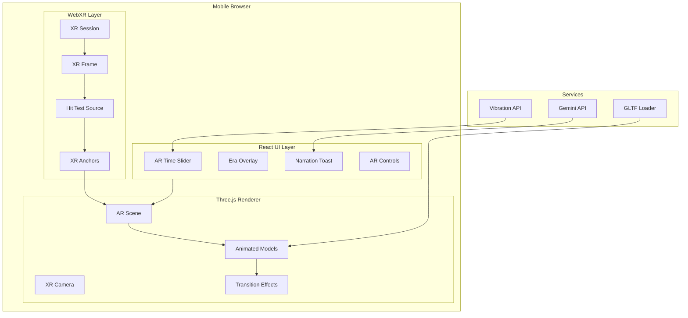

# Enhanced AR Experience Design Document

## Overview

This design transforms the DeepTime PWA into a camera-first AR experience using WebXR's immersive-ar mode with camera passthrough. The architecture leverages Three.js for 3D rendering, GLTF models with skeletal animations for creatures, and Gemini AI for dynamic narration.

The key technical challenge is delivering smooth 60fps AR with animated 3D content while maintaining PWA compatibility across iOS Safari and Android Chrome.

## Architecture



## Tech Stack Additions

| Component | Technology | Rationale |
|-----------|------------|-----------|
| 3D Models | GLTF 2.0 with Draco compression | Web-optimized, supports skeletal animation |
| Animation | Three.js AnimationMixer | Built-in GLTF animation support |
| Model Source | Sketchfab/Ready Player Me | Free animated creature models |
| Haptics | Vibration API | Native browser support |
| Transitions | Three.js ShaderMaterial | Custom dissolve/emerge effects |

## Components and Interfaces

### 1. AR Session Manager

Manages WebXR session lifecycle and camera passthrough.

```typescript
interface ARSessionManager {
  // Initialize AR session with camera passthrough
  initSession(): Promise<ARSessionState>;
  
  // End AR session and cleanup
  endSession(): void;
  
  // Get current session state
  getState(): ARSessionState;
  
  // Check if AR is supported
  isSupported(): Promise<boolean>;
  
  // Request hit test for ground plane detection
  requestHitTest(origin: Vector3, direction: Vector3): Promise<XRHitTestResult[]>;
}

interface ARSessionState {
  isActive: boolean;
  hasGroundPlane: boolean;
  groundPlaneAnchor: XRAnchor | null;
  cameraPermission: 'granted' | 'denied' | 'prompt';
  xrSupport: 'full' | 'limited' | 'none';
}
```

### 2. Creature Manager

Handles loading, animation, and interaction of 3D creature models.

```typescript
interface CreatureManager {
  // Load creatures for a specific era
  loadEraCreatures(era: GeologicalEra): Promise<Creature[]>;
  
  // Spawn creature at position on ground plane
  spawnCreature(creature: Creature, position: Vector3): CreatureInstance;
  
  // Play animation on creature
  playAnimation(instance: CreatureInstance, animation: AnimationType): void;
  
  // Handle tap interaction
  handleTap(instance: CreatureInstance): void;
  
  // Update all creature animations (called per frame)
  update(deltaTime: number): void;
  
  // Clear all creatures (for era transition)
  clearAll(): void;
}

interface Creature {
  id: string;
  name: string;
  era: string;
  modelUrl: string;
  scale: number;  // Real-world scale factor
  animations: AnimationType[];
  description: string;
}

interface CreatureInstance {
  id: string;
  creature: Creature;
  mesh: THREE.Group;
  mixer: THREE.AnimationMixer;
  position: Vector3;
  currentAnimation: AnimationType;
}

type AnimationType = 'idle' | 'walk' | 'roar' | 'attention' | 'eat';
```

### 3. Era Transition Controller

Manages visual transitions between geological eras.

```typescript
interface EraTransitionController {
  // Start transition to new era
  transitionTo(targetEra: GeologicalEra, direction: 'past' | 'future'): Promise<void>;
  
  // Check if transition is in progress
  isTransitioning(): boolean;
  
  // Cancel current transition
  cancel(): void;
}

interface TransitionEffect {
  type: 'dissolve' | 'emerge' | 'ripple';
  duration: number;  // milliseconds
  shader: THREE.ShaderMaterial;
}
```

### 4. Narration Service

Generates and displays AI-powered narration.

```typescript
interface NarrationService {
  // Generate narration for current era view
  narrateEra(era: GeologicalEra, creatures: Creature[]): Promise<Narration>;
  
  // Generate narration for specific creature
  narrateCreature(creature: Creature): Promise<Narration>;
  
  // Display narration toast
  showNarration(narration: Narration): void;
  
  // Dismiss current narration
  dismiss(): void;
}

interface Narration {
  text: string;
  duration: number;  // Auto-dismiss time in ms
  type: 'era' | 'creature' | 'discovery';
}
```

### 5. Haptic Controller

Manages vibration feedback for time navigation.

```typescript
interface HapticController {
  // Trigger haptic pulse for era boundary
  pulseEraBoundary(intensity: HapticIntensity): void;
  
  // Trigger confirmation haptic
  pulseConfirm(): void;
  
  // Check if haptics are supported
  isSupported(): boolean;
}

type HapticIntensity = 'light' | 'medium' | 'strong';
```

## Data Models

### Creature Model Manifest

```typescript
interface CreatureManifest {
  creatures: {
    [eraName: string]: CreatureDefinition[];
  };
}

interface CreatureDefinition {
  id: string;
  name: string;
  scientificName: string;
  era: string;
  period: string;
  modelUrl: string;        // GLTF model URL
  thumbnailUrl: string;    // Preview image
  scale: number;           // Meters (real-world size)
  animations: string[];    // Available animation names
  description: string;
  diet: 'herbivore' | 'carnivore' | 'omnivore';
  size: 'tiny' | 'small' | 'medium' | 'large' | 'massive';
}
```

### Example Creature Data

```json
{
  "creatures": {
    "Cretaceous": [
      {
        "id": "trex",
        "name": "Tyrannosaurus Rex",
        "scientificName": "Tyrannosaurus rex",
        "era": "Cretaceous",
        "period": "Late Cretaceous",
        "modelUrl": "/models/trex.glb",
        "thumbnailUrl": "/thumbnails/trex.png",
        "scale": 12.0,
        "animations": ["idle", "walk", "roar"],
        "description": "The king of dinosaurs, a massive predator",
        "diet": "carnivore",
        "size": "massive"
      },
      {
        "id": "triceratops",
        "name": "Triceratops",
        "scientificName": "Triceratops horridus",
        "era": "Cretaceous",
        "period": "Late Cretaceous",
        "modelUrl": "/models/triceratops.glb",
        "thumbnailUrl": "/thumbnails/triceratops.png",
        "scale": 9.0,
        "animations": ["idle", "walk", "graze"],
        "description": "Three-horned herbivore with a distinctive frill",
        "diet": "herbivore",
        "size": "large"
      }
    ],
    "Jurassic": [
      {
        "id": "brachiosaurus",
        "name": "Brachiosaurus",
        "scientificName": "Brachiosaurus altithorax",
        "era": "Jurassic",
        "period": "Late Jurassic",
        "modelUrl": "/models/brachiosaurus.glb",
        "thumbnailUrl": "/thumbnails/brachiosaurus.png",
        "scale": 25.0,
        "animations": ["idle", "walk", "eat"],
        "description": "Towering long-necked herbivore",
        "diet": "herbivore",
        "size": "massive"
      }
    ],
    "Pleistocene": [
      {
        "id": "mammoth",
        "name": "Woolly Mammoth",
        "scientificName": "Mammuthus primigenius",
        "era": "Pleistocene",
        "period": "Ice Age",
        "modelUrl": "/models/mammoth.glb",
        "thumbnailUrl": "/thumbnails/mammoth.png",
        "scale": 4.0,
        "animations": ["idle", "walk", "trumpet"],
        "description": "Ice age elephant with thick fur and curved tusks",
        "diet": "herbivore",
        "size": "large"
      }
    ]
  }
}
```


## Correctness Properties

*A property is a characteristic or behavior that should hold true across all valid executions of a system-essentially, a formal statement about what the system should do. Properties serve as the bridge between human-readable specifications and machine-verifiable correctness guarantees.*

### Property 1: Ground Plane Anchoring

*For any* detected ground plane in WebXR, all spawned 3D content SHALL have its Y-position aligned to the ground plane's Y-coordinate (within 0.01m tolerance).

**Validates: Requirements 1.3**

### Property 2: Era-Creature Mapping Consistency

*For any* era selection, all loaded creatures SHALL have an `era` field matching the selected era name.

**Validates: Requirements 2.1**

### Property 3: Default Animation State

*For any* newly loaded creature instance, the `currentAnimation` field SHALL be 'idle' before any user interaction.

**Validates: Requirements 2.2**

### Property 4: Creature Scale Accuracy

*For any* rendered creature, the mesh scale factor multiplied by the model's base size SHALL equal the creature's defined real-world `scale` value (within 5% tolerance).

**Validates: Requirements 2.4**

### Property 5: Creature Distribution Non-Overlap

*For any* set of spawned creatures on a ground plane, no two creature bounding boxes SHALL overlap by more than 10% of their volume.

**Validates: Requirements 2.5**

### Property 6: Transition Duration Bounds

*For any* era transition, the elapsed time from start to completion SHALL be between 1000ms and 2000ms.

**Validates: Requirements 3.1**

### Property 7: Transition Effect Direction

*For any* era transition where target era's `yearsAgo` is greater than current era's `yearsAgo`, the transition effect type SHALL be 'dissolve'. For transitions to newer eras (smaller yearsAgo), the effect type SHALL be 'emerge'.

**Validates: Requirements 3.2, 3.3**

### Property 8: Slider Lock During Transition

*For any* time period where `isTransitioning()` returns true, the time slider's `disabled` property SHALL be true.

**Validates: Requirements 3.5**

### Property 9: Creature-Specific Narration

*For any* creature tap event, the generated narration text SHALL contain the creature's `name` field value.

**Validates: Requirements 4.2**

### Property 10: Haptic Boundary Trigger

*For any* time slider movement that crosses an era boundary (where previous era !== current era), the haptic controller's `pulseEraBoundary` SHALL be called exactly once.

**Validates: Requirements 5.1**

### Property 11: Haptic Intensity Mapping

*For any* era boundary haptic pulse, major era boundaries (Precambrian, Paleozoic, Mesozoic, Cenozoic) SHALL use 'strong' intensity, and sub-era boundaries SHALL use 'medium' or 'light' intensity.

**Validates: Requirements 5.2**

### Property 12: UI Fade on Idle

*For any* continuous idle period exceeding 5000ms without touch events, all AR UI elements' opacity SHALL be <= 0.5.

**Validates: Requirements 6.4**

## Error Handling

| Error Condition | Handling Strategy |
|----------------|-------------------|
| WebXR not supported | Fall back to camera-only mode with 2D creature overlays |
| Camera permission denied | Show card-based interface with prompt to enable camera |
| GLTF model load failed | Show placeholder silhouette with "Loading..." indicator |
| Ground plane not detected | Show "Point at floor" instruction overlay |
| Gemini API timeout | Use pre-written fallback narrations from local cache |
| Haptics not supported | Skip haptic calls silently, no error shown |
| Low memory warning | Reduce creature count, lower texture quality |

## Testing Strategy

### Property-Based Testing

Uses **fast-check** for property tests. Key properties to test:
- Era-creature mapping consistency
- Transition effect direction logic
- Creature distribution algorithm
- Haptic boundary detection

### Unit Tests

- WebXR session initialization mocking
- GLTF loader with test models
- Animation state machine transitions
- Narration service with mocked Gemini

### Integration Tests

- Full AR flow with mocked WebXR
- Era transition with creature swap
- Haptic feedback timing

## Project Structure Additions

```
deep-time-app/
├── public/
│   └── models/              # GLTF creature models
│       ├── trex.glb
│       ├── triceratops.glb
│       ├── mammoth.glb
│       └── ...
├── src/
│   ├── ar/                  # New AR module
│   │   ├── ARSessionManager.ts
│   │   ├── CreatureManager.ts
│   │   ├── EraTransitionController.ts
│   │   └── index.ts
│   ├── components/
│   │   ├── ARView.tsx       # Enhanced with camera passthrough
│   │   ├── ARTimeSlider.tsx # Compact AR-optimized slider
│   │   ├── AROverlay.tsx    # Era label, narration toast
│   │   └── CreatureModel.tsx # Individual creature renderer
│   ├── services/
│   │   ├── narration.ts     # Enhanced with creature narration
│   │   └── haptics.ts       # New haptic controller
│   └── data/
│       └── creatures.json   # Creature manifest
```

## Model Sourcing Strategy

For the MVP, we'll use free/CC0 GLTF models from:
1. **Sketchfab** - Search for "dinosaur animated glb"
2. **Poly Pizza** - Low-poly animated creatures
3. **Quaternius** - Free game-ready animal packs

Models should be:
- Under 5MB each (compressed)
- Have at least idle + one action animation
- Rigged with skeletal animation (not morph targets)

## Performance Considerations

| Constraint | Target | Strategy |
|------------|--------|----------|
| Frame rate | 60fps | LOD system, max 3 creatures visible |
| Model size | <5MB each | Draco compression, texture atlasing |
| Load time | <3s per creature | Progressive loading, placeholder meshes |
| Memory | <200MB total | Unload off-screen creatures |
| Battery | Minimal drain | Reduce draw calls, pause when backgrounded |
