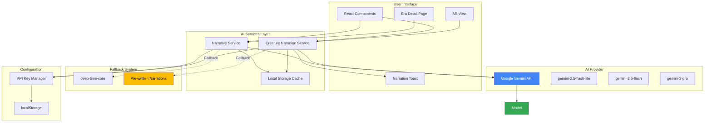
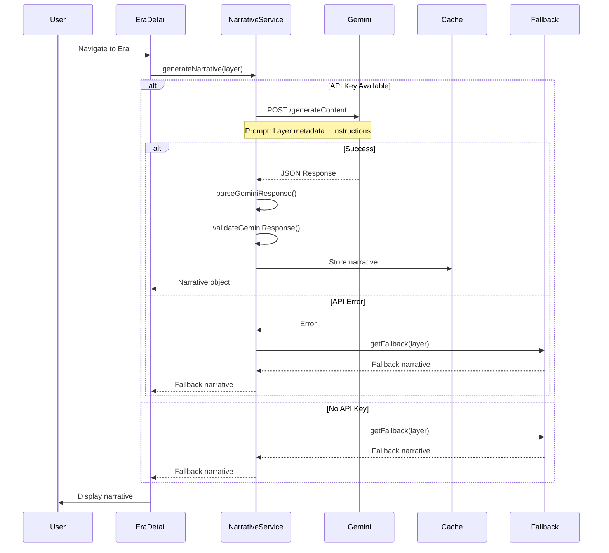
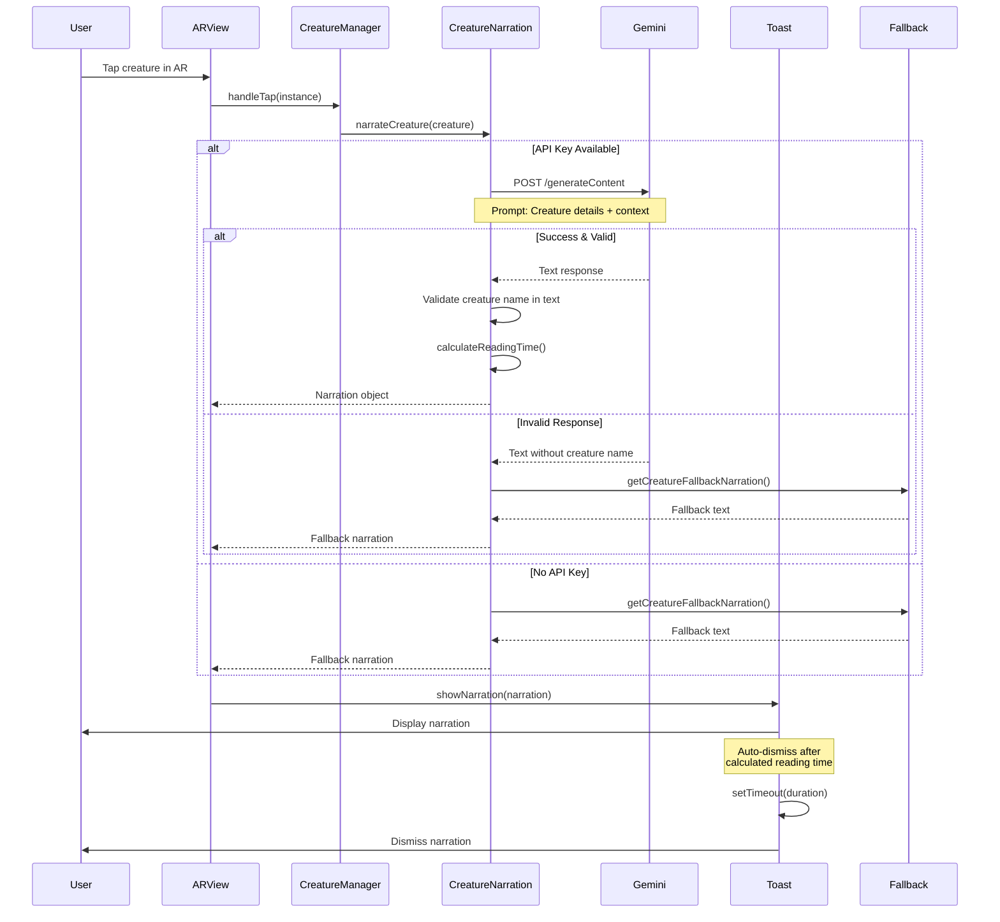
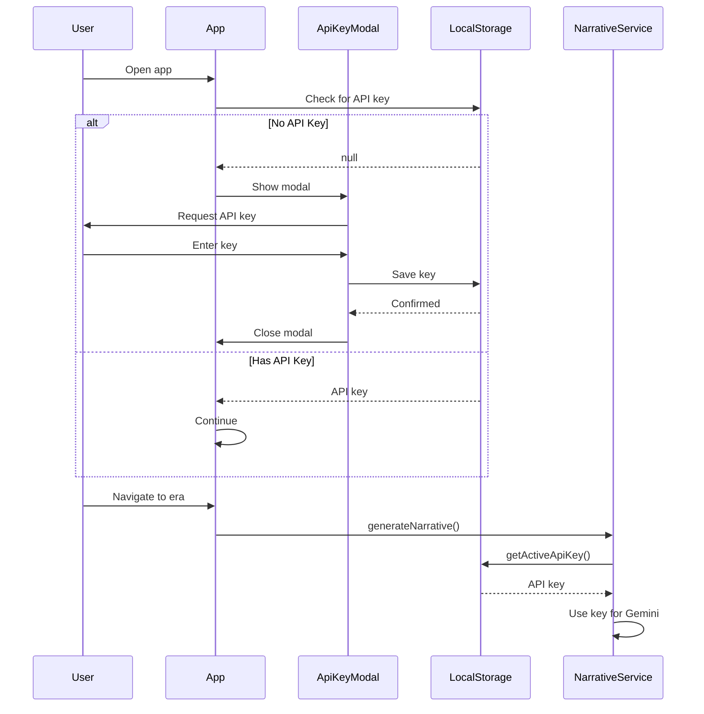
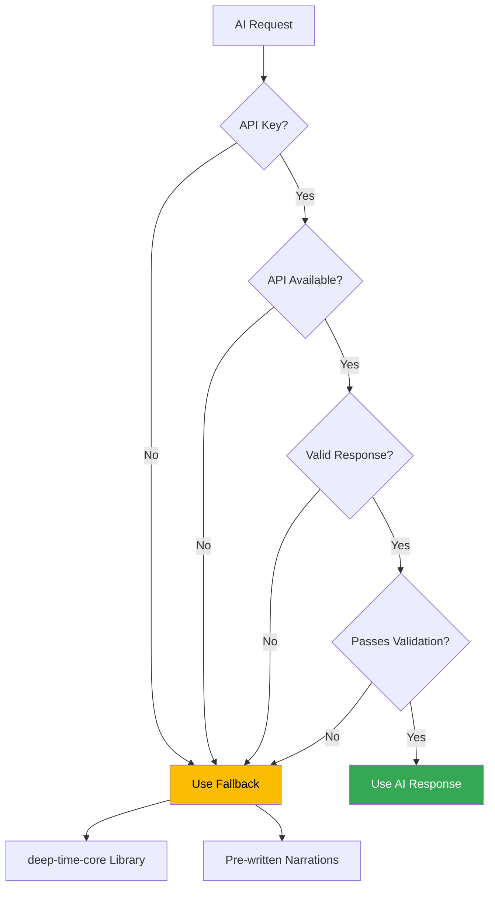
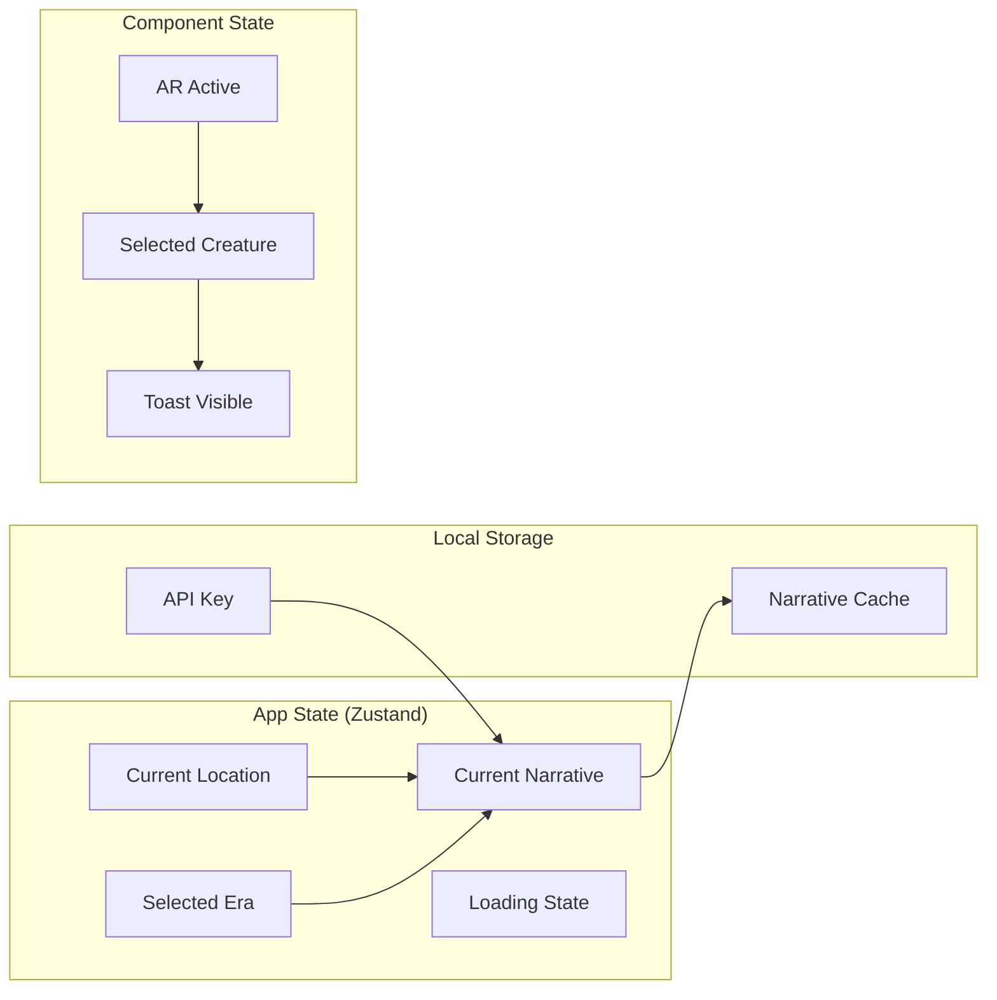
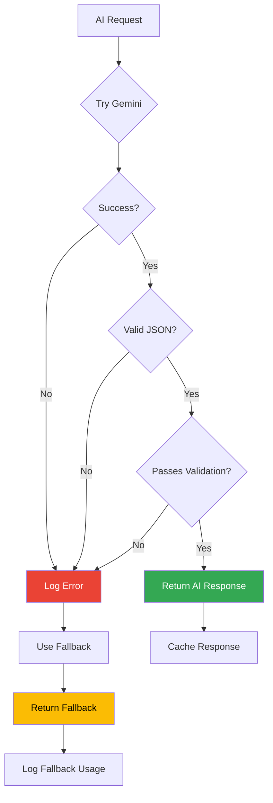

# DeepTime AI Architecture

## Overview

DeepTime integrates Google's Gemini AI to generate dynamic, contextual narratives for geological eras and prehistoric creatures. This document details all AI-related components, data flows, prompts, and control mechanisms.

---

## Table of Contents

1. [System Architecture](#system-architecture)
2. [AI Components](#ai-components)
3. [Data Flow Diagrams](#data-flow-diagrams)
4. [Prompt Engineering](#prompt-engineering)
5. [API Integration](#api-integration)
6. [Fallback Strategy](#fallback-strategy)
7. [State Management](#state-management)
8. [Error Handling](#error-handling)

---

## System Architecture

### High-Level AI Integration



---

## AI Components

### 1. Narrative Service (`narrative.ts`)

**Purpose**: Generates rich geological narratives for era layers

**Key Functions**:
- `generateNarrative(layer)` - Main AI generation function
- `getFallback(layer)` - Fallback narrative retrieval
- `parseGeminiResponse(text)` - Response validation & parsing

**AI Model**: `gemini-2.5-flash`

**Input**: `GeologicalLayer` object containing:
- Era name and period
- Years ago
- Material type
- Fossil index
- Depth range

**Output**: `Narrative` object containing:
- Short description (2-3 sentences)
- Flora array (plant species)
- Fauna array (animal species)
- Climate description (temperature, humidity, atmosphere)
- Full description
- Visual prompt
- Soundscape

### 2. Creature Narration Service (`narrative.ts`)

**Purpose**: Generates engaging narrations for AR creature interactions

**Key Functions**:
- `narrateCreature(creature)` - Creature-specific narration
- `narrateEra(eraName, creatures)` - Era welcome narration
- `calculateReadingTime(text)` - Auto-dismiss timing

**AI Model**: `gemini-2.5-flash-lite` (Flash-Lite - Fastest, most cost-efficient)

**Input**: `Creature` object containing:
- Name and scientific name
- Era and period
- Diet and size
- Scale (meters)
- Description

**Output**: `Narration` object containing:
- Text (2-3 sentences)
- Duration (calculated reading time)
- Type ('creature' | 'era' | 'discovery')

### 3. API Key Manager (`ApiKeyModal.tsx`)

**Purpose**: Manages user-provided Gemini API keys

**Features**:
- Runtime API key configuration
- Secure local storage
- Key validation
- Visual key management UI

**Storage**: `localStorage` key: `gemini_api_key`

---

## Data Flow Diagrams

### Era Narrative Generation Flow



### Creature Interaction Flow



### API Key Configuration Flow



---

## Prompt Engineering

### 1. Era Narrative Prompt

**Template**:
```
You are a geological storyteller. Given this layer data:
- Era: {era.name} ({yearsAgo} years ago)
- Period: {era.period}
- Material: {material}
- Fossil Index: {fossilIndex}
- Depth: {depthStart}m to {depthEnd}m

Generate a vivid, engaging narrative (2-3 sentences) describing what this 
location looked like during this era. Include specific flora, fauna, and 
climate details. Return ONLY valid JSON with no markdown formatting:
{
  "shortDescription": "A brief 1-2 sentence description",
  "flora": ["plant1", "plant2", "plant3"],
  "fauna": ["creature1", "creature2", "creature3"],
  "climate": { 
    "temperature": "description", 
    "humidity": "description", 
    "atmosphere": "description" 
  }
}
```

**Example Input**:
```typescript
{
  era: { name: "Cretaceous", period: "Mesozoic", yearsAgo: 100000000 },
  material: "limestone",
  fossilIndex: "exceptional",
  depthStart: 50,
  depthEnd: 150
}
```

**Example Output**:
```json
{
  "shortDescription": "During the Late Cretaceous, this region was a warm, shallow sea teeming with marine life. Massive marine reptiles like mosasaurs hunted among coral reefs.",
  "flora": ["seaweed", "marine algae", "coral", "sea grass"],
  "fauna": ["mosasaurs", "ammonites", "sea turtles", "prehistoric sharks"],
  "climate": {
    "temperature": "warm tropical",
    "humidity": "very humid",
    "atmosphere": "oxygen-rich"
  }
}
```

### 2. Creature Narration Prompt

**Template**:
```
You are a paleontology expert and engaging storyteller. A user has tapped 
on a {creature.name} ({creature.scientificName}) in an AR experience.

Creature details:
- Name: {creature.name}
- Scientific Name: {creature.scientificName}
- Era: {creature.era} ({creature.period})
- Diet: {creature.diet}
- Size: {creature.size} (approximately {creature.scale} meters)
- Description: {creature.description}

Generate a brief, engaging narration (2-3 sentences) that:
1. MUST include the creature's name "{creature.name}" in the text
2. Describes an interesting fact or behavior about this creature
3. Helps the user imagine what it would be like to encounter this creature

Return ONLY the narration text, no JSON or formatting. Keep it 
conversational and exciting.
```

**Example Input**:
```typescript
{
  name: "Tyrannosaurus Rex",
  scientificName: "Tyrannosaurus rex",
  era: "Cretaceous",
  period: "Late Cretaceous",
  diet: "carnivore",
  size: "massive",
  scale: 12.0,
  description: "The king of dinosaurs, a massive predator..."
}
```

**Example Output**:
```
The mighty Tyrannosaurus Rex stands before you, the undisputed apex 
predator of the Late Cretaceous. With a bite force of over 12,000 pounds 
and teeth the size of bananas, this 12-meter giant could crush the bones 
of its prey with ease. Imagine the ground shaking with each thunderous 
step as it hunts across the ancient landscape!
```

### 3. Era Welcome Prompt

**Template**:
```
You are a time-travel guide narrating an AR experience. The user has just 
arrived in the {eraName} era and can see these creatures around them:

{creature1.name}: {creature1.description}
{creature2.name}: {creature2.description}
...

Generate a brief, immersive welcome narration (2-3 sentences) that:
1. Sets the scene for the {eraName} era
2. Mentions at least one of the visible creatures: {creatureNames}
3. Creates a sense of wonder and discovery

Return ONLY the narration text, no JSON or formatting. Keep it 
conversational and exciting.
```

**Example Output**:
```
Welcome to the Jurassic period, 150 million years ago! Towering 
Brachiosaurus graze on treetops while swift Allosaurus prowl the fern 
forests below. You're standing in the golden age of dinosaurs, when these 
magnificent creatures ruled the Earth.
```

---

## Model Selection Strategy

### Gemini 2.5 Model Lineup

DeepTime uses the latest Gemini 2.5 models for optimal performance and cost-efficiency:

| Model | Speed | Cost | Context | Best For | Use Case in DeepTime |
|-------|-------|------|---------|----------|---------------------|
| **Gemini 2.5 flash-lite** | Fastest | Lowest | 1M tokens | Real-time interactions | Creature narrations, AR interactions |
| **Gemini 2.5 Flash** | Fast | Moderate | 1M tokens | Balanced performance | Era narratives, detailed descriptions |
| **Gemini 3 Pro** | Moderate | Higher | 2M tokens | Complex reasoning | Future: Quizzes, personalization |

### Model Assignment by Feature

```typescript
// Real-time AR creature interactions (tap-to-narrate)
CREATURE_NARRATION: 'gemini-2.5-flash-lite'  // ~200-500ms latency

// Era welcome messages in AR
ERA_WELCOME: 'gemini-2.5-flash-lite'  // Fast, engaging

// Detailed geological era narratives
ERA_NARRATIVE: 'gemini-2.5-flash'  // Better reasoning for complex data

// Future: Educational features
QUIZ_GENERATION: 'gemini-3-pro'  // Advanced reasoning
PERSONALIZATION: 'gemini-3-pro'  // Complex user modeling
```

### Why This Strategy?

**flash-lite for AR Interactions**:
- **Latency matters**: Users expect instant feedback when tapping creatures
- **High frequency**: Users may tap multiple creatures rapidly
- **Mobile optimization**: Faster responses on mobile networks
- **Cost efficiency**: Free tier lasts longer with cheaper model

**Flash for Era Narratives**:
- **Complex data**: Geological layers have rich metadata
- **Quality matters**: Initial era load sets the tone
- **Structured output**: Better at generating valid JSON
- **Acceptable latency**: Users expect a brief load time

**Pro for Future Features**:
- **Advanced reasoning**: Quiz generation requires deeper understanding
- **Personalization**: Complex user preference modeling
- **Multi-turn conversations**: Future chat features

---

## API Integration

### Gemini API Configuration

**Endpoint**: `https://generativelanguage.googleapis.com/v1beta/models/{model}:generateContent`

**Models Used**:
- **gemini-2.5-flash-lite** (Flash-Lite) - Real-time AR creature narrations & era welcomes
- **gemini-2.5-flash** (Flash) - Detailed geological era narratives
- **gemini-3-pro** (Pro) - Future advanced features (quizzes, personalization)

**Authentication**: API Key (Bearer token)

**Request Format**:
```typescript
{
  contents: [{
    parts: [{
      text: string  // The prompt
    }]
  }]
}
```

**Response Format**:
```typescript
{
  candidates: [{
    content: {
      parts: [{
        text: string  // The generated text
      }]
    }
  }]
}
```

### API Client Initialization

```typescript
// Runtime API key (user-provided)
const apiKey = getActiveApiKey() || import.meta.env.VITE_GEMINI_API_KEY;

// Create client
const client = new GoogleGenerativeAI(apiKey);

// Get model (using centralized config)
import { MODEL_USE_CASES } from '../config/aiModels';
const model = client.getGenerativeModel({ 
  model: MODEL_USE_CASES.ERA_NARRATIVE  // gemini-2.5-flash
});

// Generate content
const result = await model.generateContent(prompt);
const text = result.response.text();
```

### Rate Limiting & Quotas

**Gemini API Limits** (Free Tier):
- 60 requests per minute
- 1,500 requests per day
- 32,000 tokens per request

**App Strategy**:
- Cache narratives in localStorage
- Use fallbacks when quota exceeded
- Batch requests when possible
- Implement exponential backoff on errors

---

## Fallback Strategy

### Fallback Hierarchy



### Fallback Sources

#### 1. Core Library Fallbacks (`deep-time-core`)

**Location**: `deep-time-core/narrative`

**Coverage**: All geological eras

**Quality**: Scientifically accurate, generic descriptions

**Example**:
```typescript
{
  shortDescription: "The Cretaceous period was characterized by warm climates...",
  flora: ["flowering plants", "conifers", "ferns"],
  fauna: ["dinosaurs", "pterosaurs", "early mammals"],
  climate: {
    temperature: "warm",
    humidity: "moderate",
    atmosphere: "oxygen-rich"
  }
}
```

#### 2. Pre-written Creature Narrations

**Location**: `narrative.ts` - `CREATURE_FALLBACK_NARRATIONS`

**Coverage**: 12 creatures across 6 eras

**Quality**: Engaging, fact-checked, creature-specific

**Creatures Covered**:
- Cretaceous: T-Rex, Triceratops, Velociraptor
- Jurassic: Brachiosaurus, Stegosaurus, Allosaurus
- Pleistocene: Mammoth, Sabertooth, Megatherium
- Triassic: Coelophysis
- Permian: Dimetrodon
- Carboniferous: Meganeura

#### 3. Pre-written Era Narrations

**Location**: `narrative.ts` - `ERA_FALLBACK_NARRATIONS`

**Coverage**: 6 major eras

**Quality**: Immersive, contextual, era-specific

---

## State Management

### AI-Related State



### State Flow

**1. App Initialization**:
```typescript
// Check for API key
const apiKey = localStorage.getItem('gemini_api_key');
if (!apiKey) {
  showApiKeyModal();
}

// Load cached narratives
const cachedNarratives = localStorage.getItem('narrative_cache');
```

**2. Era Navigation**:
```typescript
// User selects era
setSelectedEra(era);

// Trigger narrative generation
const narrative = await narrativeService.generateNarrative(layer);

// Update state
setNarrative(narrative);
setLoading(false);
```

**3. AR Interaction**:
```typescript
// User taps creature
const narration = await creatureNarrationService.narrateCreature(creature);

// Show toast
showNarration(narration);

// Auto-dismiss
setTimeout(() => dismissNarration(), narration.duration);
```

---

## Error Handling

### Error Types

```typescript
type NarrativeErrorType =
  | 'api_error'      // Gemini API failure
  | 'parse_error'    // JSON parsing failure
  | 'rate_limit'     // Quota exceeded
  | 'invalid_response'; // Response validation failure
```

### Error Handling Flow



### Error Recovery Strategy

**1. API Errors**:
```typescript
try {
  const result = await model.generateContent(prompt);
  return parseResponse(result);
} catch (error) {
  console.warn('Gemini API error:', error);
  return getFallback(layer);
}
```

**2. Validation Errors**:
```typescript
const parsed = JSON.parse(text);
if (!validateGeminiResponse(parsed)) {
  console.warn('Invalid Gemini response structure');
  return getFallback(layer);
}
```

**3. Rate Limiting**:
```typescript
if (error.status === 429) {
  console.warn('Rate limit exceeded, using fallback');
  // Could implement exponential backoff here
  return getFallback(layer);
}
```

**4. Property Validation** (Creature Narration):
```typescript
// Property 9: Creature name must be in narration
if (!text.toLowerCase().includes(creature.name.toLowerCase())) {
  console.warn('Narration missing creature name');
  return getCreatureFallbackNarration(creature);
}
```

---

## Performance Considerations

### Caching Strategy

**1. Narrative Cache**:
- Store generated narratives in localStorage
- Key: `narrative_${layerId}`
- TTL: 7 days
- Max size: 5MB

**2. API Response Cache**:
- Cache successful Gemini responses
- Avoid redundant API calls for same era
- Clear cache on API key change

### Optimization Techniques

**1. Lazy Loading**:
```typescript
// Only load AI service when needed
const narrativeService = lazy(() => import('./services/narrative'));
```

**2. Request Batching**:
```typescript
// Batch multiple creature narrations
const narrations = await Promise.all(
  creatures.map(c => narrateCreature(c))
);
```

**3. Debouncing**:
```typescript
// Debounce era changes to avoid excessive API calls
const debouncedGenerateNarrative = debounce(generateNarrative, 500);
```

---

## Security Considerations

### API Key Management

**Storage**: localStorage (client-side only)

**Transmission**: HTTPS only

**Exposure**: Never logged or sent to analytics

**Validation**: Client-side validation before use

### Best Practices

1. **Never commit API keys** to version control
2. **Use environment variables** for development
3. **Implement rate limiting** on client side
4. **Sanitize AI responses** before display
5. **Validate all AI outputs** against schema

---

## Monitoring & Analytics

### Key Metrics

**1. AI Usage**:
- API calls per session
- Success rate
- Fallback usage rate
- Average response time

**2. User Experience**:
- Narration engagement (time spent reading)
- Creature interaction rate
- API key configuration rate

**3. Error Tracking**:
- API error frequency
- Validation failure rate
- Fallback trigger reasons

### Logging Strategy

```typescript
// Success
console.log('AI narration generated:', {
  type: 'era' | 'creature',
  duration: responseTime,
  cached: boolean
});

// Fallback
console.warn('Using fallback narration:', {
  reason: error.type,
  layer: layerId
});

// Error
console.error('AI generation failed:', {
  error: error.message,
  type: error.type
});
```

---

## Future Enhancements

### Planned AI Features

1. **Voice Narration**:
   - Text-to-speech integration
   - Multiple voice options
   - Language support

2. **Personalized Narratives**:
   - User interest tracking
   - Adaptive difficulty levels
   - Learning path recommendations

3. **Interactive Q&A**:
   - Chat interface for questions
   - Context-aware responses
   - Educational mode

4. **Image Generation**:
   - AI-generated era visualizations
   - Creature reconstructions
   - Landscape rendering

5. **Multi-modal AI**:
   - Vision API for real-world context
   - Audio analysis for soundscapes
   - Gesture recognition for AR

---

## Appendix

### A. API Key Setup Guide

**For Users**:
1. Visit [Google AI Studio](https://aistudio.google.com/app/apikey)
2. Sign in with Google account
3. Click "Create API Key"
4. Copy the key
5. Paste into DeepTime app settings

**For Developers**:
1. Create `.env` file in `deep-time-app/`
2. Add: `VITE_GEMINI_API_KEY=your_key_here`
3. Restart dev server

### B. Testing AI Features

**Manual Testing**:
```bash
# Test era narration (Flash)
curl -X POST https://generativelanguage.googleapis.com/v1beta/models/gemini-2.5-flash:generateContent \
  -H "Content-Type: application/json" \
  -H "x-goog-api-key: YOUR_API_KEY" \
  -d '{"contents":[{"parts":[{"text":"Generate a Cretaceous era narrative"}]}]}'

# Test creature narration (Flash-Lite)
curl -X POST https://generativelanguage.googleapis.com/v1beta/models/gemini-2.5-flash-lite:generateContent \
  -H "Content-Type: application/json" \
  -H "x-goog-api-key: YOUR_API_KEY" \
  -d '{"contents":[{"parts":[{"text":"Tell me about T-Rex"}]}]}'
```

**Unit Testing**:
```typescript
// Mock Gemini responses
vi.mock('@google/generative-ai', () => ({
  GoogleGenerativeAI: vi.fn(() => ({
    getGenerativeModel: () => ({
      generateContent: vi.fn().mockResolvedValue({
        response: { text: () => mockResponse }
      })
    })
  }))
}));
```

### C. Troubleshooting

**Issue**: "API key not working"
- **Solution**: Verify key in Google AI Studio, check for typos

**Issue**: "Rate limit exceeded"
- **Solution**: Wait 1 minute, or use fallback narratives

**Issue**: "Invalid JSON response"
- **Solution**: Check prompt format, validate response structure

**Issue**: "Narration missing creature name"
- **Solution**: Prompt includes explicit instruction, fallback will be used

---

## Document Version

**Version**: 2.0  
**Last Updated**: December 5, 2025  
**Author**: DeepTime Development Team  
**Status**: Production - Updated for Gemini 2.5 Models
